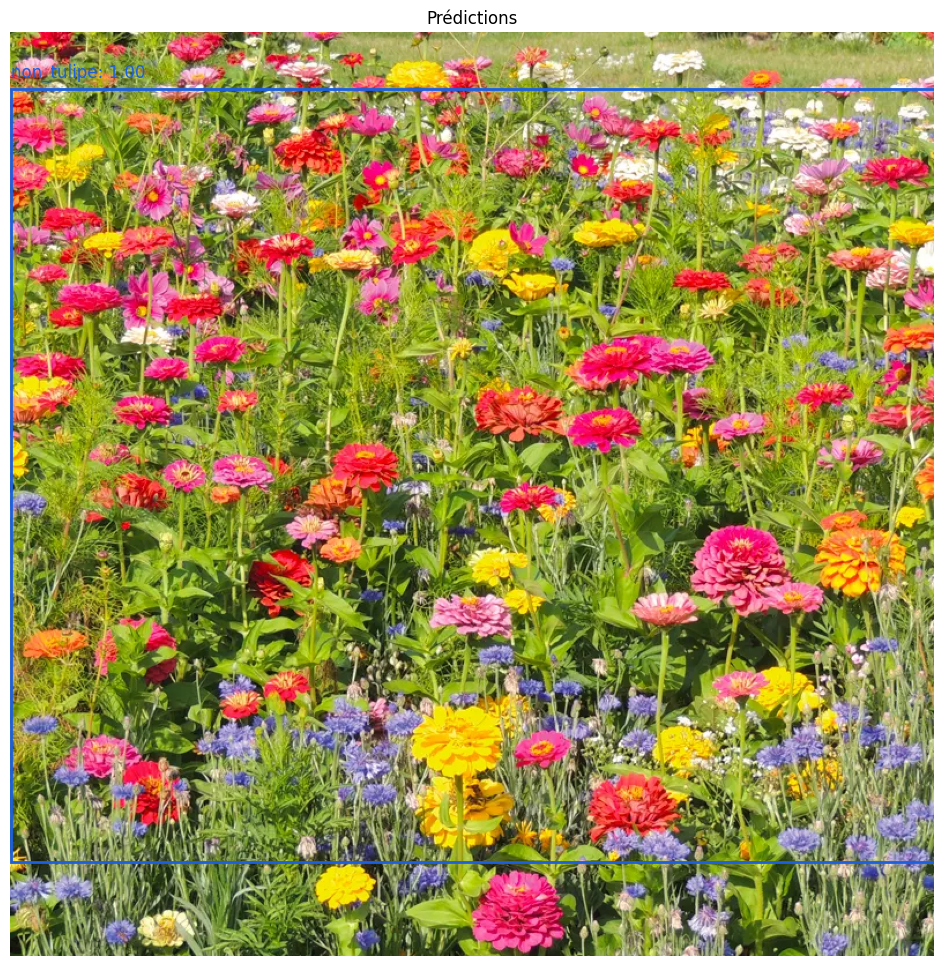
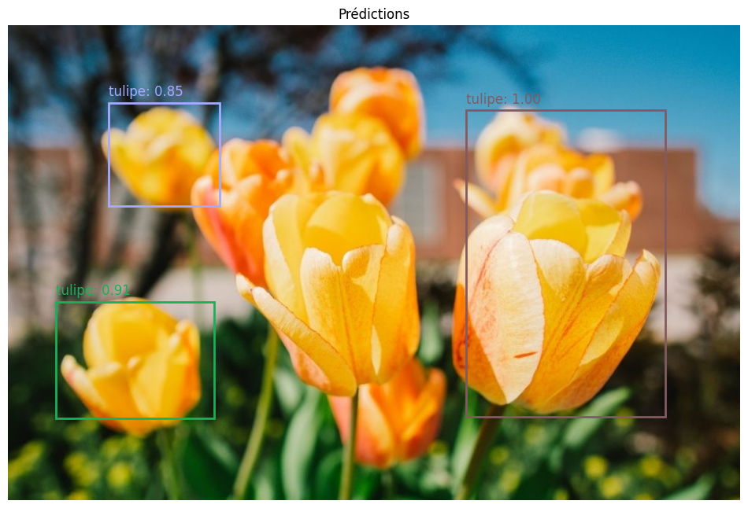
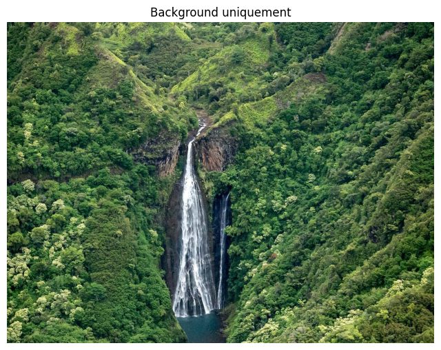
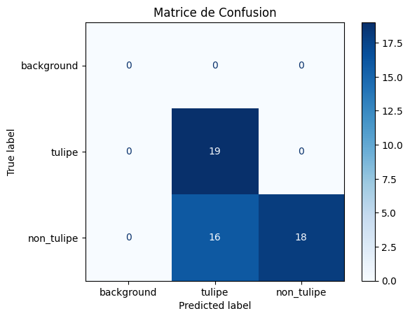
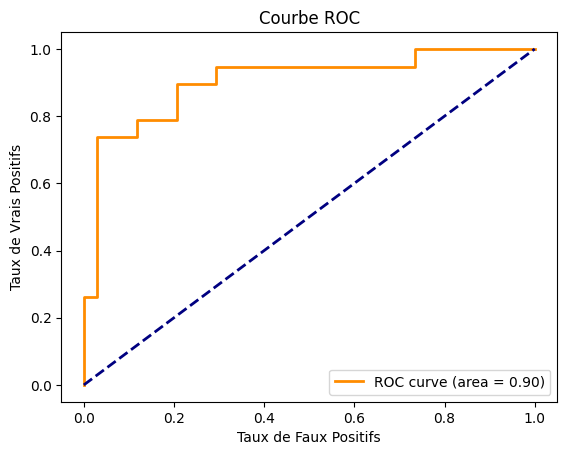
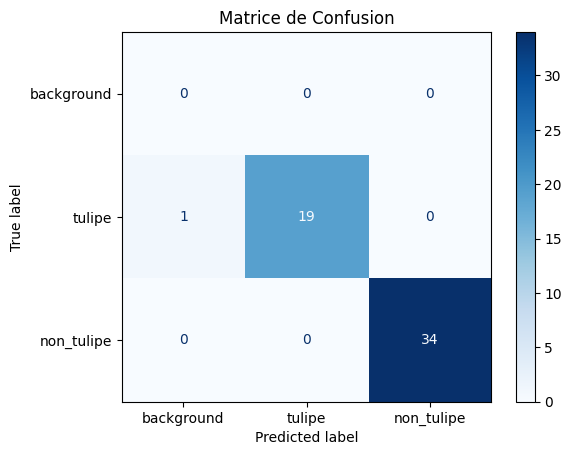
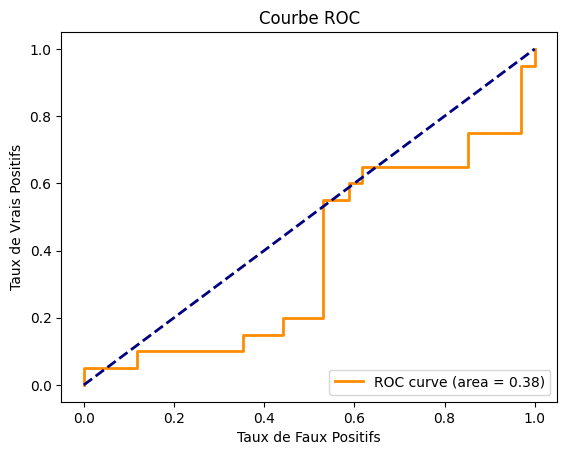
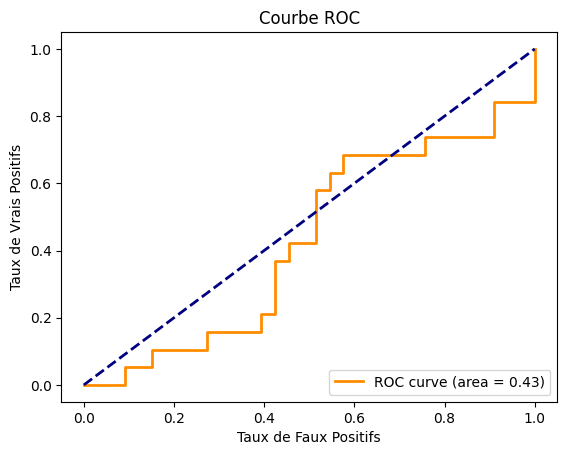

# IA_Object_Detection
# Ryad BELARBI
# Ameni FEKI
# Projet Mask R-CNN : Classification des Fleurs

Ce projet utilise Mask R-CNN pour classifier les images de fleurs en deux catégories : **Tulipe** et **Non-Tulipe**. Ce README fournit des détails complets sur les tests d'entraînement effectués avec différents nombres d'époques (20, 30, 40, 50), les résultats obtenus, les observations sur le surapprentissage (overfitting), et des visualisations clés pour évaluer les performances du modèle.


## Installation des Dépendances

Ce projet utilise plusieurs bibliothèques pour l’entraînement du modèle Mask R-CNN, la manipulation d’images, et la visualisation de données. Suivez les instructions ci-dessous pour installer les packages nécessaires avec les versions compatibles.

### Commandes d'Installation

Exécutez les commandes suivantes pour installer les dépendances :

```bash
# Installer Keras
python -m pip install Keras==2.2.4 Keras-Applications==1.0.8 Keras-Preprocessing==1.1.2

# Installer TensorFlow
python -m pip install tensorflow==1.15.0 tensorflow-estimator==1.15.1 tensorboard==1.15.0

# Installer Scikit-Image (en installant également ses dépendances courantes)
python -m pip install scikit-image==0.16.2

# Autres dépendances essentielles
python -m pip install numpy==1.21.6 scipy==1.7.3 pandas==1.0.3 matplotlib==3.5.3 Pillow==9.5.0

# Packages supplémentaires pour la manipulation et l'affichage des données
python -m pip install seaborn==0.11.2 tqdm==4.66.6 requests==2.31.0

# Pour la manipulation JSON et les fichiers de labels (Labelme2COCO, Pybboxes)
python -m pip install jsonschema==4.17.3 labelme2coco==0.2.6 pybboxes==0.1.6

# Installations pour des modules auxiliaires comme l'interface utilisateur et le client Jupyter
python -m pip install jupyter-client==7.4.9 jupyter-core==4.12.0 nest-asyncio==1.6.0

# Packages pour le développement d'algorithmes et calculs mathématiques avancés
python -m pip install absl-py==2.1.0 cloudpickle==2.2.1 dask==2022.2.0

# Packages de manipulation d'images et de fichiers multimédia
python -m pip install opencv-python==3.4.13.47 imageio==2.10.4

# Installations pour les réseaux de neurones et autres applications IA
python -m pip install torch==1.13.1 sahi==0.11.18

# Installations pour gérer les fichiers et le système
python -m pip install fsspec==2023.1.0 importlib-resources==5.12.0 importlib-metadata==6.7.0

# Installations pour la manipulation de JSON et la gestion des chemins de fichiers
python -m pip install attrs==24.2.0 pyparsing==3.1.4 typing-extensions==4.7.1

# Gestion des demandes réseau et de l'interface utilisateur
python -m pip install urllib3==1.26.16 termcolor==2.3.0 colorama==0.4.6

# Autres utilitaires importants pour le système et les structures de données
python -m pip install setuptools==68.0.0 wheel==0.42.0 wrapt==1.16.0
```
---

## Structure du Projet

- **Dossier `data_t`** : Contient les images et annotations JSON pour les ensembles d'entraînement et de validation. Les images sont annotées avec les classes "tulipe" et "non_tulipe".
- **Dossier `logs`** : Contient les journaux d'entraînement générés par TensorBoard, permettant le suivi des pertes et des métriques de performance.
- **Fichier `mask_rcnn_coco.h5`** : Fichier de poids pré-entraînés sur le dataset COCO pour initialiser Mask R-CNN.

---

## Configurations et Hyperparamètres

- **Classes** : Le modèle est entraîné pour reconnaître deux classes : "tulipe" (classe 1) et "non_tulipe" (classe 2) et la classe background.
- **Taux d'apprentissage** : `LEARNING_RATE` est fixé à 0.001 pour assurer une convergence stable et éviter les oscillations dans les pertes.
- **Nombre d'époques** : Plusieurs configurations d'époques ont été testées pour évaluer l'impact sur les performances du modèle et identifier le point optimal avant le surapprentissage.

---

## Expériences et Résultats

Nous avons effectué des entraînements avec des nombres d'époques différents : 10, 20 et 30 époques. Voici un résumé des observations et résultats pour chaque configuration d'époques :

### 1. Entraînement sur 20 Époques

- **Résumé** : Avec 20 époques, le modèle a atteint des performances équilibrées en termes de précision d'entraînement et de validation. Les courbes de perte d'entraînement et de validation restent proches, indiquant une bonne généralisation.
- **Observations** : Les résultats en validation sont cohérents avec ceux de l'entraînement, sans signes de surapprentissage (overfitting).
- **Conclusion** : Ce nombre d'époques semble idéal, car il maximise les performances de généralisation du modèle sur l'ensemble de validation sans apprendre de manière excessive les caractéristiques spécifiques aux données d'entraînement.

### 2. Entraînement sur 30 Époques

- **Résumé** : À 30 époques, le modèle commence à montrer des signes de surapprentissage. La perte d'entraînement continue de diminuer, mais la perte de validation stagne et augmente légèrement.
- **Observations** : La précision en validation commence à diminuer, indiquant que le modèle apprend davantage de caractéristiques spécifiques aux données d'entraînement plutôt que de généraliser sur de nouvelles données.
- **Conclusion** : 30 époques semblent légèrement excessives pour ce dataset et cette configuration, bien que les performances soient encore acceptables.

### 3. Entraînement sur 40 Époques

- **Résumé** : Avec 40 époques, le surapprentissage est plus prononcé. La perte d'entraînement continue de baisser, tandis que la perte de validation augmente de manière significative.
- **Observations** : La précision en validation diminue notablement, confirmant que le modèle est en surapprentissage.
- **Conclusion** : Ce nombre d'époques est trop élevé pour cette tâche, car le modèle ne parvient plus à bien généraliser.

### 4. Entraînement sur 50 Époques

- **Résumé** : L'entraînement sur 50 époques entraîne un surapprentissage excessif. La perte d'entraînement atteint des valeurs très faibles, mais la perte de validation est bien supérieure, indiquant un modèle sur-adapté aux données d'entraînement.
- **Observations** : La précision en validation chute, et les résultats en validation deviennent très éloignés des performances en entraînement.
- **Conclusion** : Cette configuration n'est pas recommandée, car elle montre une très mauvaise généralisation aux nouvelles données.

---

## Choix Optimal : Entraînement sur 20 Époques

Après avoir comparé les performances des différentes configurations, l'entraînement sur **20 époques** s'est révélé être la meilleure option. À ce stade, le modèle atteint un équilibre entre précision d'entraînement et généralisation sur l'ensemble de validation. Avec plus de 20 époques, le modèle commence à tomber dans le surapprentissage, apprenant trop de caractéristiques spécifiques aux données d'entraînement.

---

## Test avec epoque 20 
## image1 


## voici son resultat 


## image 2


## voici son resultat 




## image 3


## voici son resultat 




## image 4


## voici son resultat 




## matrice de confusion du resultat du modele en une seule epoque 



## courbe Roc du resultat du modele en une seule epoque 



## matrice de confusion du resultat du modele en 20 epoques 



## matrice de confusion du resultat du modele en 20 epoques 



## matrice de confusion du resultat du modele en 30 epoques 


## matrice de confusion du resultat du modele en 30 epoques 


